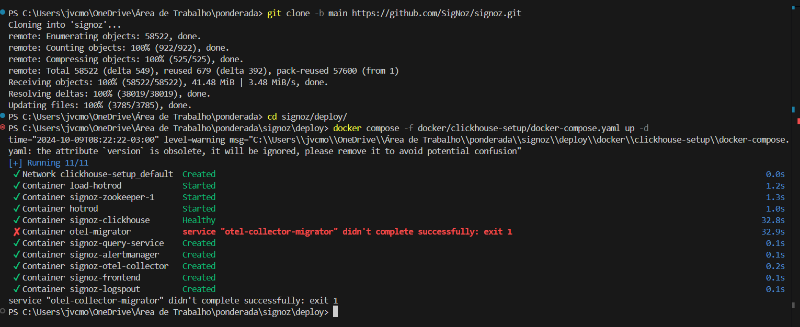
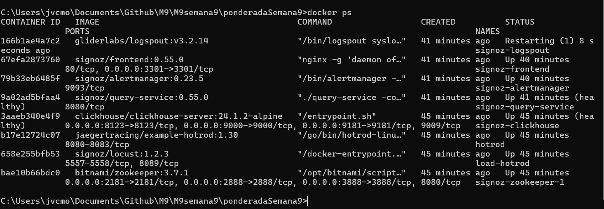
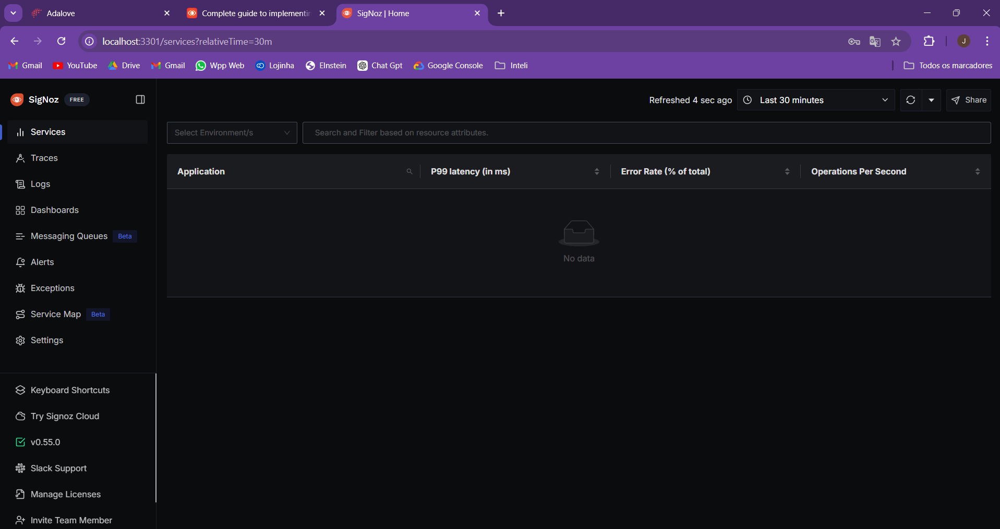
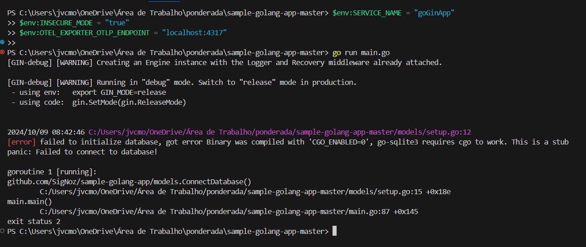
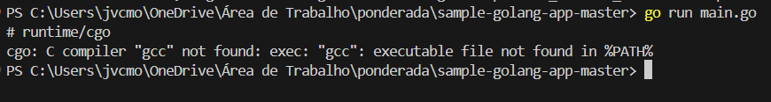
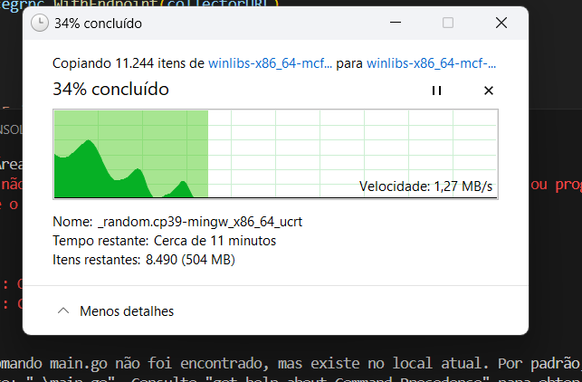
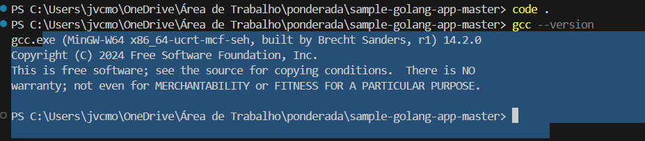
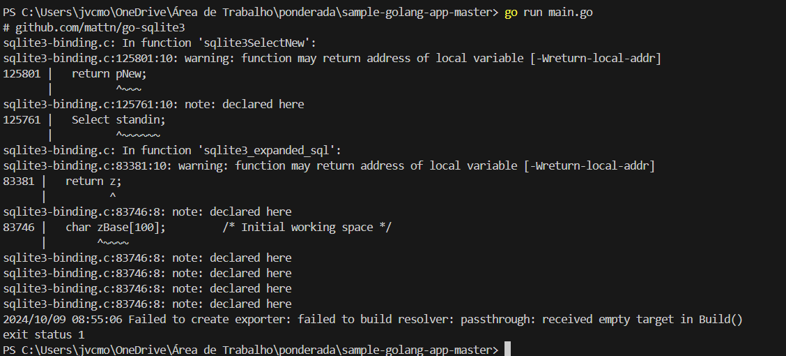

COnsegui fazer o signoz rodar apesar de ter tido alguns erros , que talvez tenham sido a causa de eu nao ter conseguido finalizar a tarefa 

# Erro 
  Aqui eu tive que entrar no compose.yaml e manualmente alterar umas coisas, possivelmente isso que me levou as ruinas.

 

# Docker rodando 

# Signoz rodando

# Erro Main go
  Aqui deu um erro de compilador, então fui e baixei ele

# Erro especifico

# Dowload Gcc

# Sucesso na instalacao GCC

# E por fim deu esse erro que nao consegui resolver nem a pau

